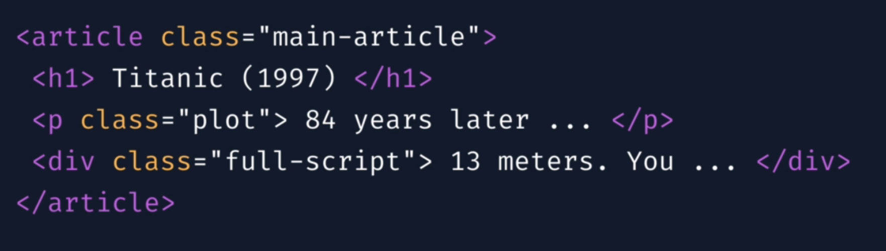

### Selenium Commands

#### Find elements with Selenium

##### Locate Single Element
1. driver.find_element(By.ID,'id') - 

2. driver.find_element(By.CLASS_NAME,'class_name')

3. driver.find_element(By.TAG_NAME,'tag')

4. driver.find_element(By.XPATH,'//tagName[@AttributeName = "value"]')

5. driver.find_element_by(By.CSS_SELECTOR)

6. driver.find_element(By.NAME)

7. driver.find_element(By.LINK_TEXT)

##### Locate Multiple Elements
1. driver.find_elements(By.CLASS_NAME) -> it will return data in list format- > list = [a,b,c,d]

##### Example :

##### Commands : 
	1. driver.find_element(By.CLASS_NAME,'main-article')
	
	2. driver.find_element(By.CLASS_NAME,'plot')
	
	3. driver.find_element(By.TAG_NAME,'h1')
	
	4. driver.find_element(By.TAG_NAME,'p')
